# Отчет по проделанной работе.

## Введение. 

Создание репозитория на GitHub:
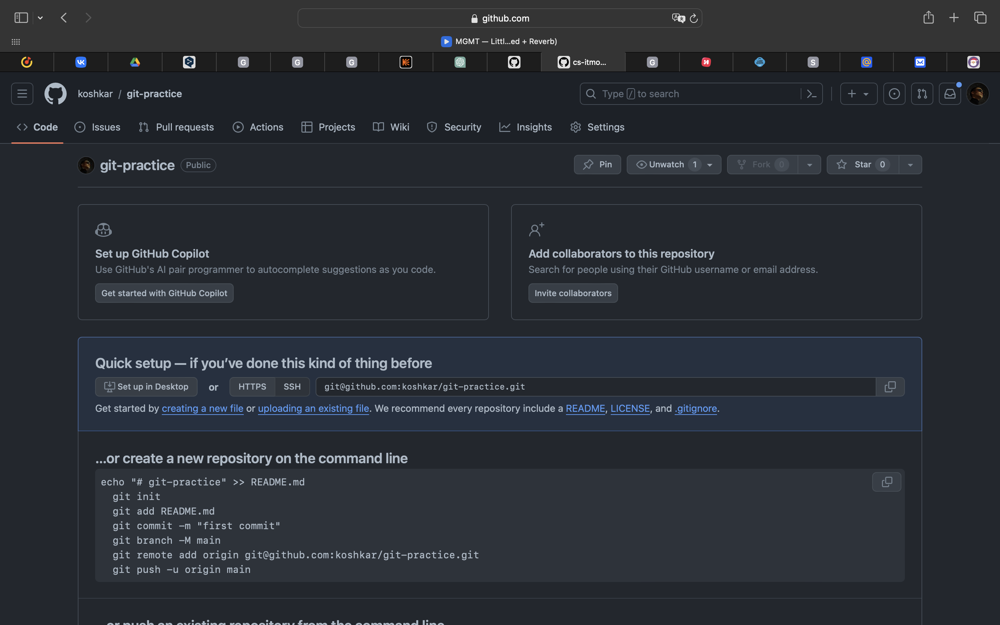

Клонирование репозитория:
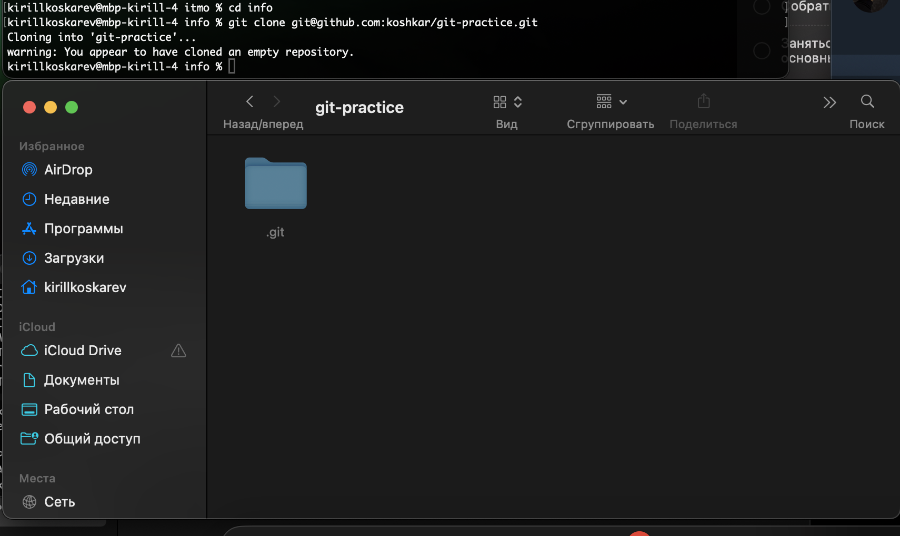

Добавление файла:
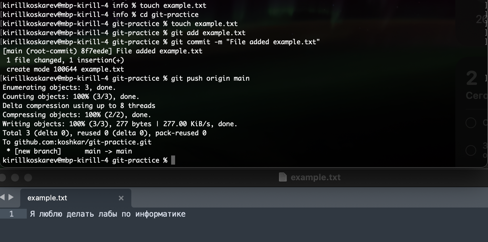

Создание ветки + редактирование файла:
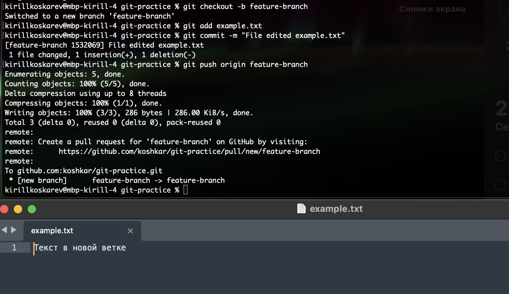
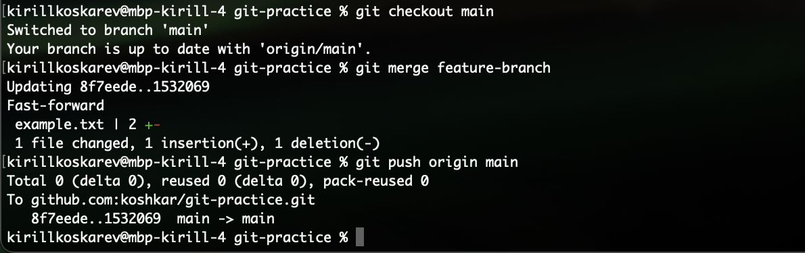

## Работа с ветками.

Создание нового файла, ветки + внесенные изменения:
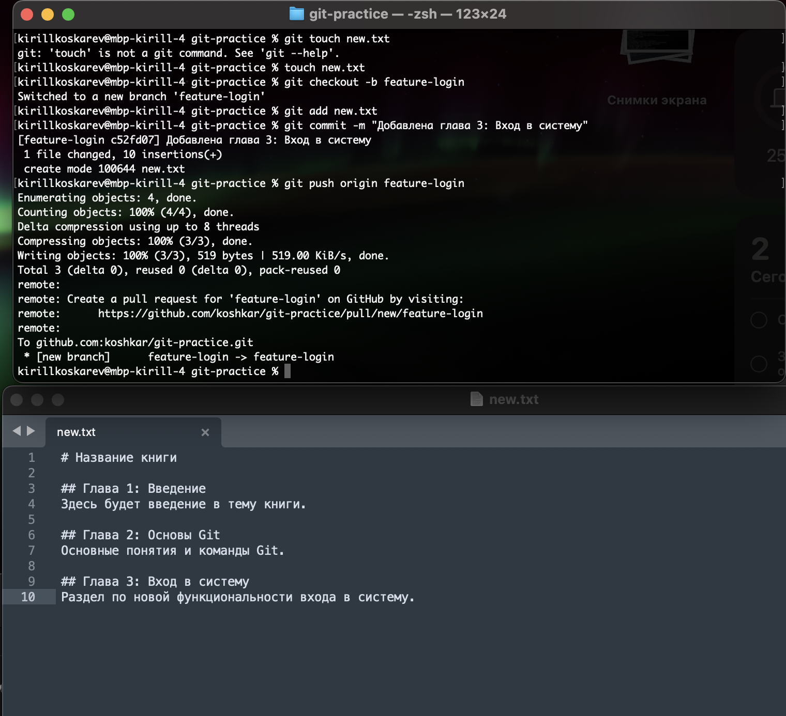

## Работа с удаленным репозиторием.

Внесение изменений в основной ветке:
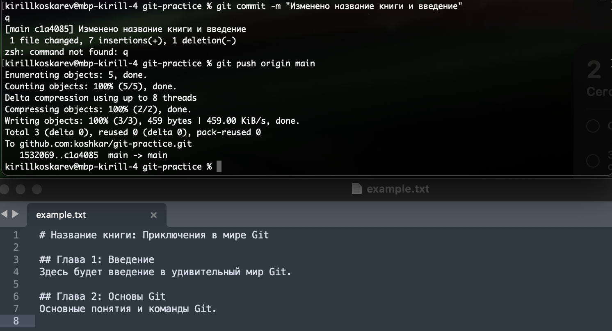

## Моделирование конфликта.

Изменения главы №2:
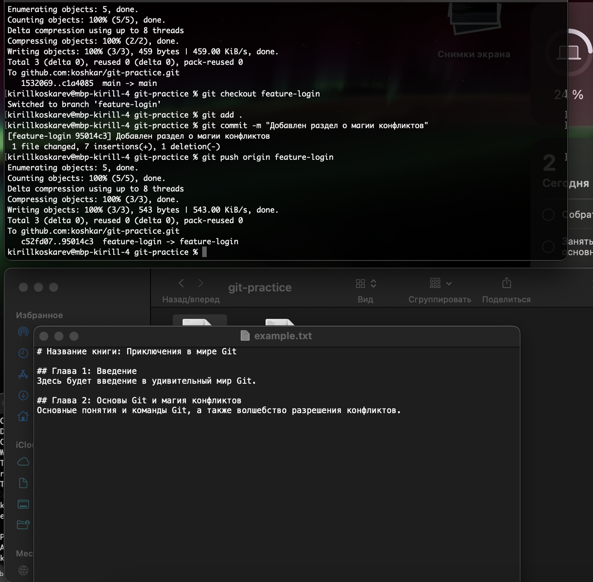

## Разрешение конфликта.

Удаляем метки, пушим изменения:
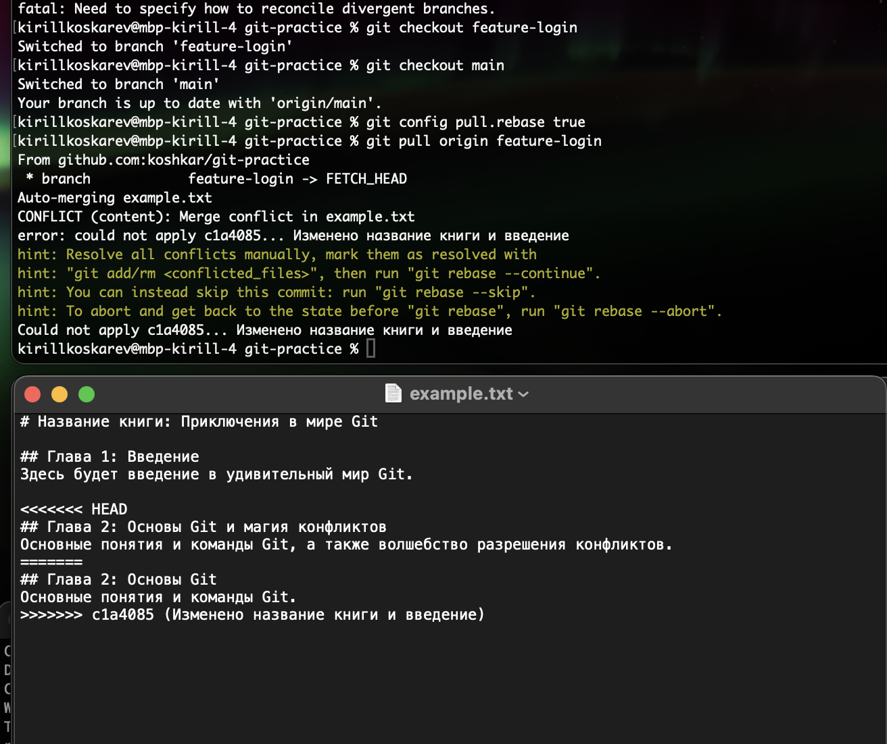

## Автоматизация проверки формата файлов при коммите.

Создаем скрипт:
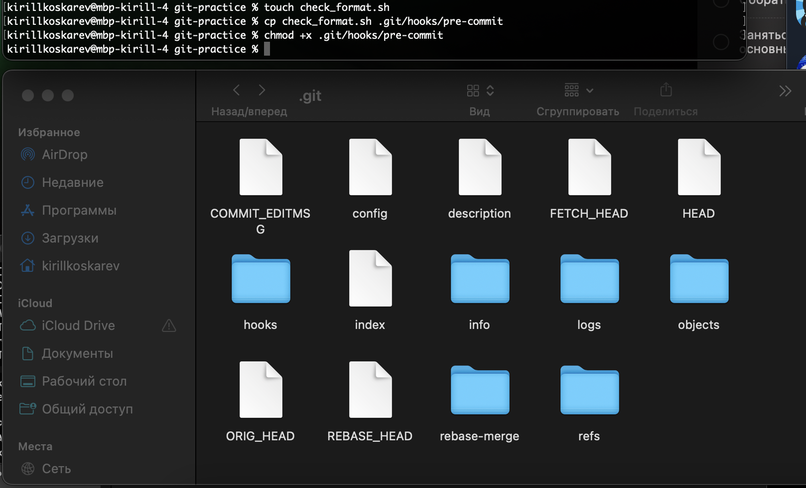
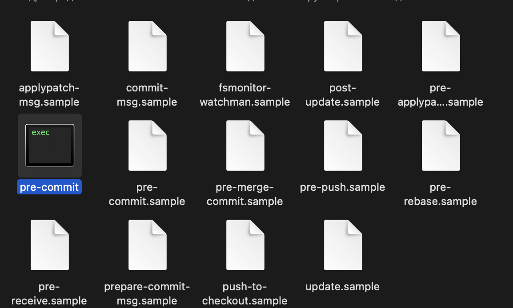

Сам скрипт:
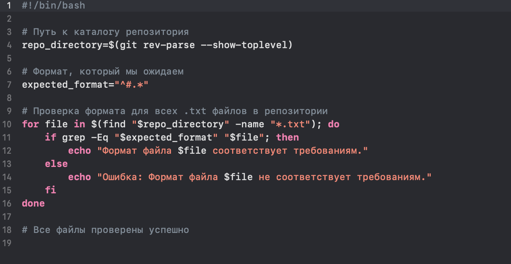

## Использование Git Flow в проекте.

Установка __GitFlow__:
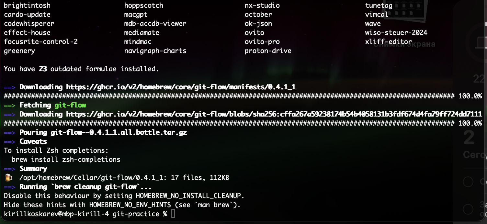

Работаем с новыми ветками новых функциональностей при помощи __GitFlow__:
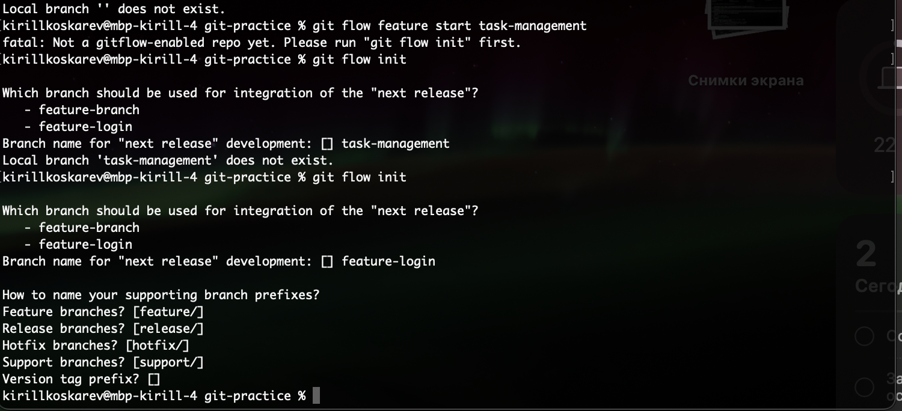

Вносим изменения в рабочий код, сохраняем и завершаем работу с фичей:
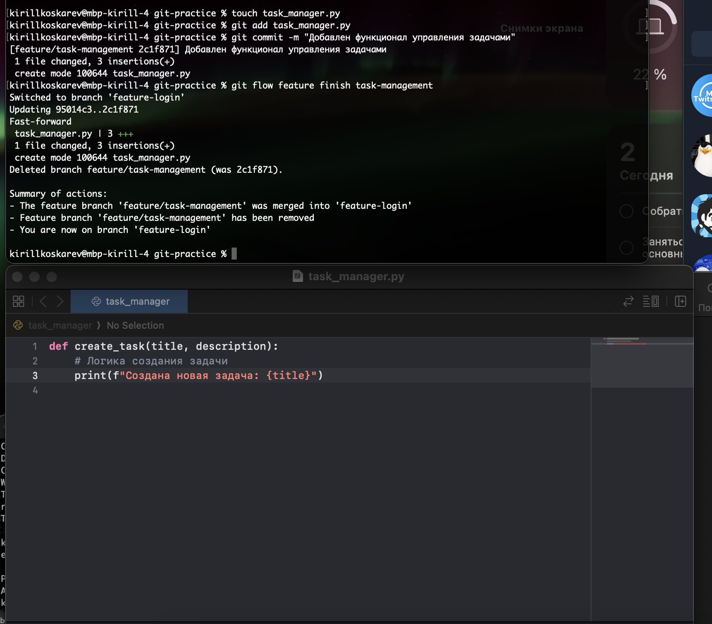

Создаем релиз, завершаем его, подтягивая в ветки **main** и **develop** (develop = feature-login):
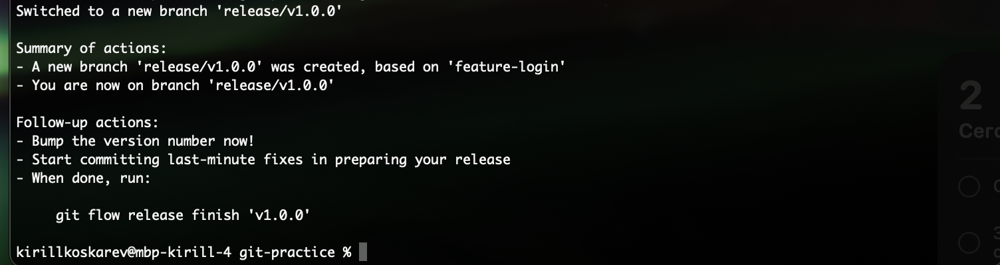
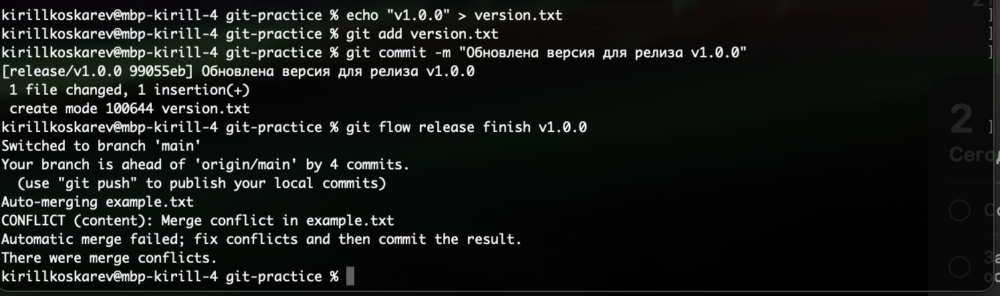

